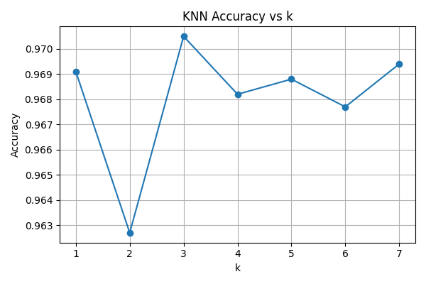
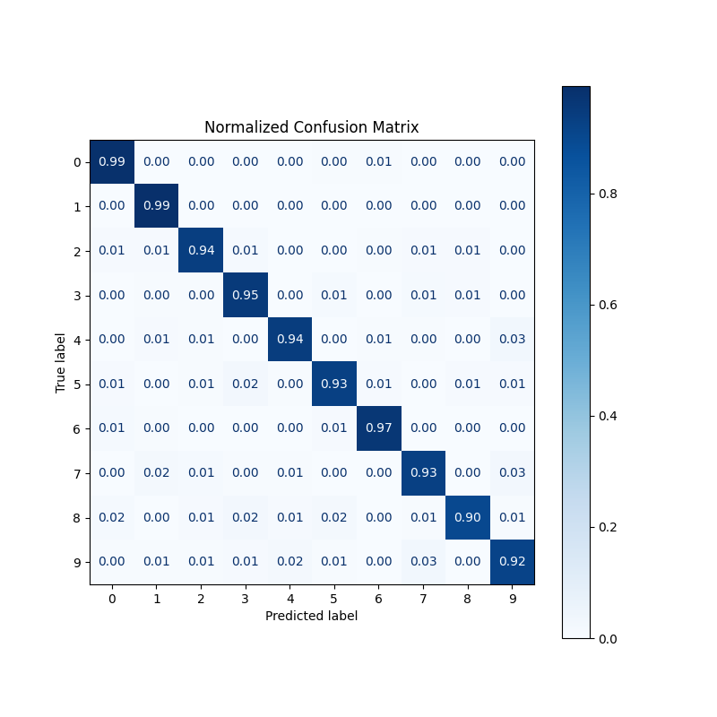
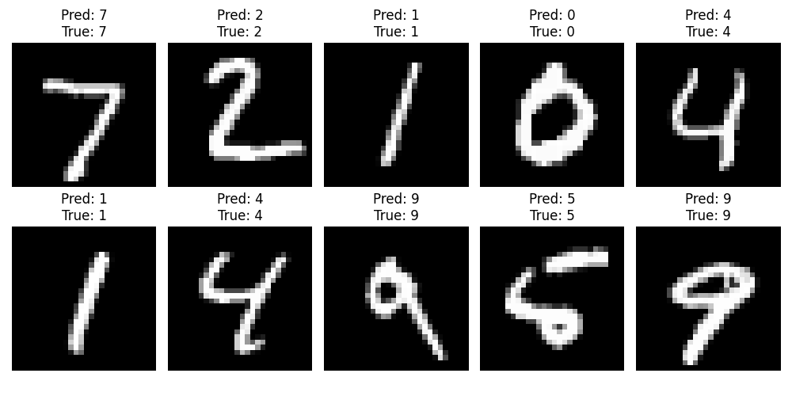

# Project-2

# 🖊️ KNN on MNIST – Handwritten Digit Recognition

This project implements the **K-Nearest Neighbors (KNN)** algorithm on the famous **MNIST handwritten digits dataset**.  
It includes accuracy tuning, performance evaluation visualizations, and even a simple GUI where you can draw a digit and see the model's prediction in real time.

---

## 📌 How It Works
KNN is a simple yet powerful algorithm:
1. For each new image, it finds the **k most similar images** in the training set.
2. These neighbors **"vote"** for the most common digit among them.
3. The digit with the most votes is the predicted label.

In this project:
- **Accuracy vs k** was plotted to choose the best `k` value (k=3 gave the highest validation accuracy).
- **Confusion matrix** and **classification report** were generated to analyze the model's performance.
- A GUI was created to test the model with your own handwritten digits.

---

## 📊 Results
- **Best k:** 3  
- **Highest validation accuracy:** ~97.1%  
- **Final test accuracy:** 94.5%  
- Strong performance across most digits, with occasional confusions between visually similar digits (like 4 and 9).

---

## 📷 Visuals

### Accuracy vs k


### Normalized Confusion Matrix


### Classification Report


### Sample Predictions


---

## 🎨 GUI
A simple graphical interface is included to draw digits and get real-time predictions from the KNN model.  
Run the GUI using:
```bash
python knn_gui.py

